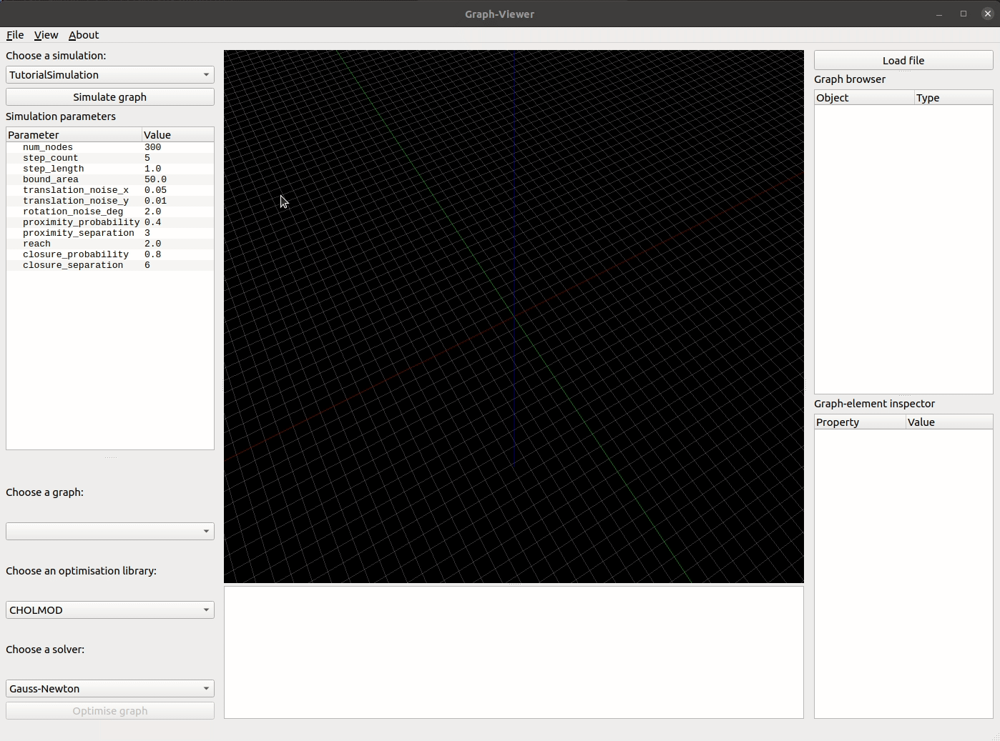

# Self-Calibrating SLAM

MSc-Thesis work  of [Art van Liere](mailto:artvanliere@gmail.com)

# Table of Contents

- [Self-Calibrating SLAM](#self-calibrating-slam)
- [Getting Started](#getting-started)
- [Contact Info](#contact-info)

# Getting Started

## Requirements

Self-Calibrating SLAM Python framework:
- **[pip3](https://pypi.org/project/pip/)** (with ```apt install python3-pip```)
- **[pyqt5](https://pypi.org/project/PyQt5/)** (with ```pip3 install pyqt5``` or ```apt install python3-pyqt5```)
- **[pyqtgraph](http://www.pyqtgraph.org/)** (with  ```pip3 install pyqtgraph``` or ```apt install python-pyqtgraph```)

g2o:
- **[cmake](https://cmake.org/)** (with ```apt install cmake```)
- **[eigen3](http://eigen.tuxfamily.org)** (with ```apt install libeigen3-dev```)
- **[suitesparse](http://faculty.cse.tamu.edu/davis/suitesparse.html)** (_optional_, with ```apt install libsuitesparse-dev```)
- **[Qt5](http://qt-project.org)** (_optional_, with ```apt install qtdeclarative5-dev``` and ```apt install qt5-qmake```)
- **[libQGLViewer](http://libqglviewer.com/)** (_optional_, with ```apt install libqglviewer-dev-qt5```)

## Installation

Self-Calibrating SLAM Python framework:
- ```pip3 install -e path/to/self-calibrating-slam/``` (or ```pip3 install -e .``` when in the root directory) to install the package in editable state.

g2o:
- ```mkdir build``` in the ```g2o/``` directory
- ```cd build```
- ```cmake ../```
- ```make```

# Framework

## GUI



The GUI intuitively allows for graph creation, optimisation and analysis.
- ```python3 gui.py``` in ```src/gui/```

# Contact Info

Art van Liere\
[artvanliere@gmail.com](mailto:artvanliere@gmail.com)\
+31 6 51 66 18 75